# Git and GitHub

**Agenda**

- Introduction to Version Control System and Git
- Starting with Git
- Making changes to the local repository
- Branching in Git
- Syncing with the central repository

## Version Control System (VCS)

Before the invention of VCS, people made copies of files to reflect the changes.

#### Issues with the manual version control system

- Difficult to identify the changes between files over time.
- Not efficient with projects that have thousands of files.
- Difficult to collaborate when multiple people work on the same files.
- Difficult to revert to the previous version.
- Difficult to store the metadata (such as who made the changes, date, and reason).

So, it isn't easy to maintain the file version manually. This is where VCS helps you.

#### What is a Version Control System :

A Version Control System (VCS) is a software development tool that tracks and manages changes made to files over time.

#### Why Version Control System :

1. **Collaboration**: Multiple users can work on the same project without conflicts.
2. **Version tracking**: Track changes and identify who made them and when.
3. **Backup and recovery**: Recover previous versions in case of errors or data loss.
4. **Branching and merging**: Work on new features or bug fixes without affecting the main project.

**Advantages:**

1. **Version history**: Track changes and revert if needed.
2. **Collaboration**: Multiple users can work together.
3. **Backup**: Regular backups ensure data safety.
4. **Flexibility**: Work on different branches and features.
5. **Scalability**: Manage large projects and teams.

**Disadvantages:**

1. **Learning curve**: Steep learning curve for beginners.
2. **Complexity**: Manage conflicts and merges.
3. **Storage**: Large repositories require significant storage.
4. **Security**: Ensure access control and data protection.
5. **Dependence**: Reliance on VCS for collaboration and versioning.

#### Basic keywords of Version Control System:

1. **Repository** (Repo): Central location for storing project files.
   1. **Remote**
   2. **Local**
2. **Commit**: Saving changes with a meaningful message.
3. **Branch**: Separate line of development, e.g., feature/new feature.
4. **Merge**: Combining changes from different branches.
5. **Push**: Uploading changes to a remote repository.
6. **Pull**: Downloading changes from a remote repository.

## What is Git?

Git is a free and open-source Version Control System (VCS). It's a distributed system, meaning every developer working on a project has a local copy of the entire project history.

Git was created by Linus Torvalds in 2005, Who is also a creator of Linux. Read More about [Linus Torvalds](https://en.wikipedia.org/wiki/Linus_Torvalds)

#### Benefits of Git:

- Widely used Version Control System
- Fast performance because it is a distributed system allows full local operations
- Multiple users can work together
- Data integrity through SHA-1 hashing

#### Popular platforms for Git:

- **GitHub**: Web-based Git repository hosting.
- **GitLab**: Web-based Git repository hosting with built-in CI/CD tools.
- **Bitbucket**: Web-based Git and Mercurial repository hosting.

#### Basic Git workflow:

- **Initialize**: Create a new repository with `git init`
- **Add**: Add files to the repository with `git add`
- **Commit**: Save changes with a meaningful message using `git commit`
- **Push**: Upload changes to a remote repository with `git push`
- **Pull**: Download changes from a remote repository with `git pull`
- **Merge**: Combine changes from different branches using `git merge`

### Git vs GitHub

The short answer is **NO**
Any **VCS** will have two parts:

1. **Local Repository**
   - Where Developers make changes on their laptop/Desktop.
   - Git is used in the local repository.
2. **Remote Repository**
   - Remote server where you will push the changes so others can access it.
   - GitHub is used in the remote repository

### Creating an account on GitHub and Creating a repository

### Git Configuration

`git config` is a command to configure Git settings, such as user information, repository settings, and behaviour. It allows you to customize Git to suit your needs.

`git config --global user.name "Your Name"`
`git config --global user.email "your@email.com"`

**To check the folder status**

`$git status`
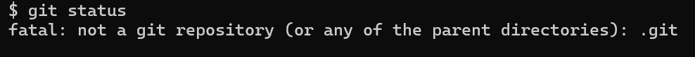

**To initialize the repository**

`$git init`

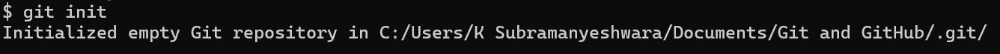

Git will track this folder.

**What will happen if we check the status after initiating the Git?**
`$git status`
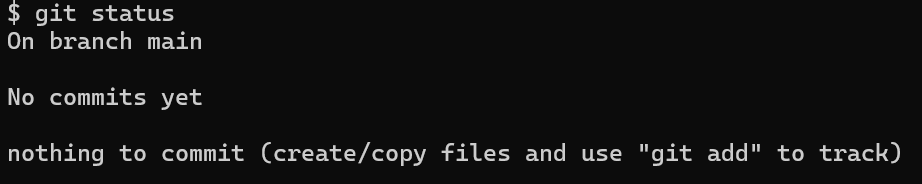

How to create a file inside the folder? You can use the `vi` editor on the terminal, or you can manually make a file inside the folder.

If you decide to create a folder through the `vi` editor in the terminal, you need to enter `$vi fileName.txt`
Once you enter the `vi` editor, you must enter insert mode by clicking `i` on your keyboard. Then only you can write.

Once you complete the writing, press `esc` and then press `:wq!` to save the notes you have written and exit.

To see the content inside the text file that you have created, use `$cat fileName.txt`

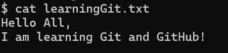

What does `.git` contain?
The `.git` directory, also known as the Git repository directory, is a hidden folder that Git uses to store metadata about a repository. It contains all the necessary information to manage the repository.

**What will happen if we check the status after creating a file?**
`$git status`

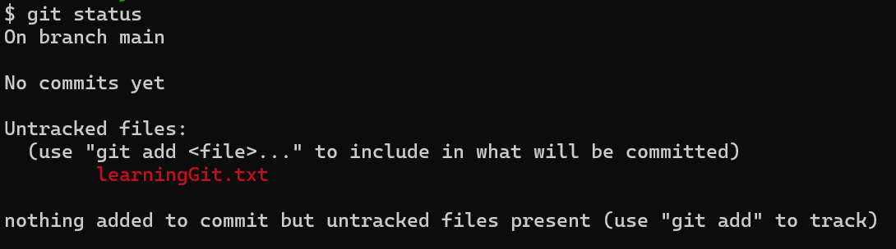

Git is saying that there is an untracked file.

#### Statges of Git

- Untracked
  - Files that Git is not tracking.
  - Newly added files that haven't been staged or committed.
- Modified
  - Files that have been changed but have not yet been committed.
  - Files that are different from the last commit.
- Staged
  - Files that have been modified and added to the staging area.
  - Files ready to be committed.
- Committed
  - Files that have been safely stored in the local repository.
  - Files that have been committed and are part of the project history.
    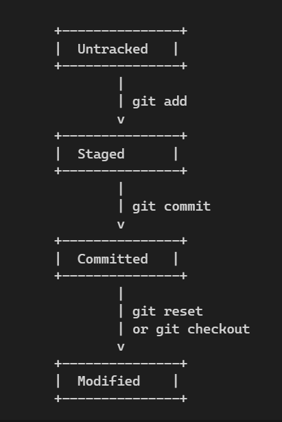

**To add file to staging area**
`$git add fileName.txt`
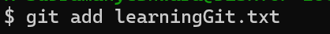
No error means added successfully

**What will happen if we check the status after adding a file to the staging area?**
`$git status`
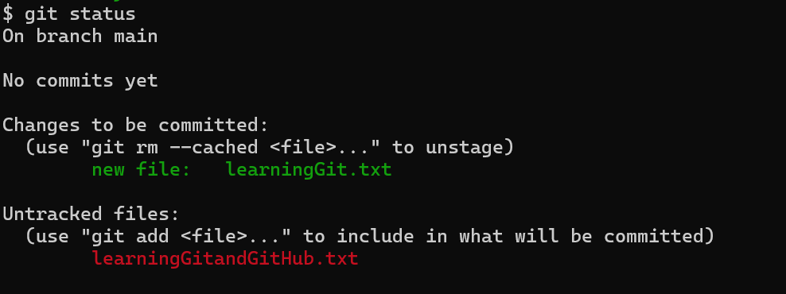

**How do you unstage the file that has been staged?**

`$git rm --cached learningGit.txt`
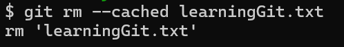

You can see the below image, which clearly shows that no file is staged.
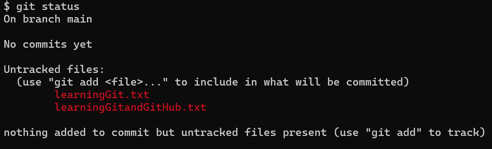

**How to add multiple files at a time?**

Before adding multiple files, let's check the status,

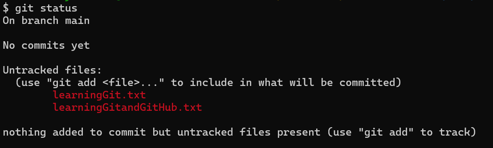

`$git add .`

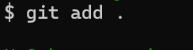
If nothing is showing, it means git added all the files to the staging area. Let's check by using the status command

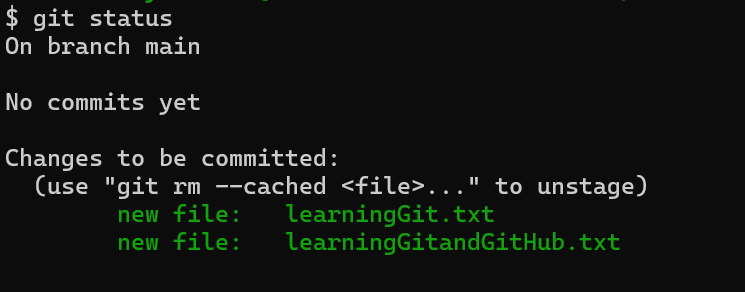

To unstage all the files at a time use,

`$git reset`
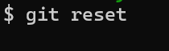
If nothing is showing, it means git removed all the files from the staging area. Let's check by using the status command

VCS is basically used to have a version of the software. So `$git commit` records the changes made to the repository.
`$git commit` contains:

- Commit message
- Author information.
- Timestamp.
- Parent commit(s).

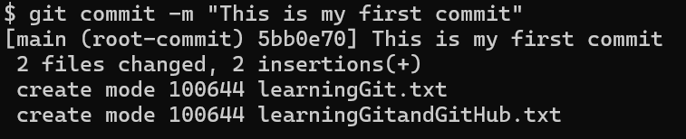

Once there is nothing to commit, the following message will be displayed.
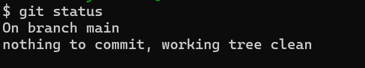

How to see all the commits made to the repository?
`$git log`

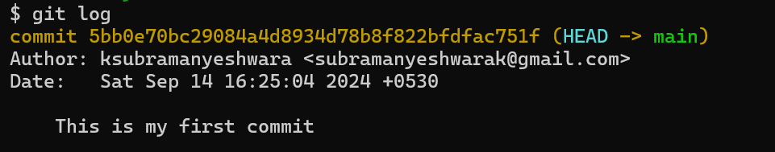

1. Show a log of all commits made to the repository.
2. View details about each commit, such as:

- Commit hash (ID)
- Author and date
- Commit message
- Changed files

If you want to see the details of the last n commits, then
`$git log -n 1`

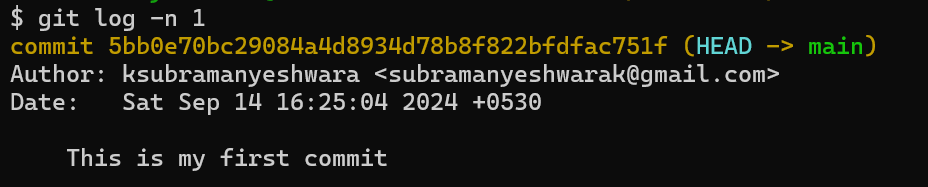

If you want to check the commits done by specific person then
`$git log --author=<author-name>`

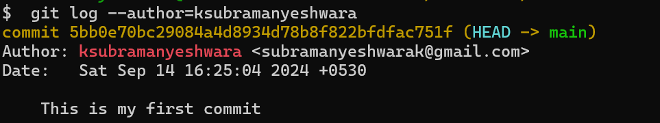

To see the commit details,
`$git show <commit-hash>`

It gives all the details of the particular commit.
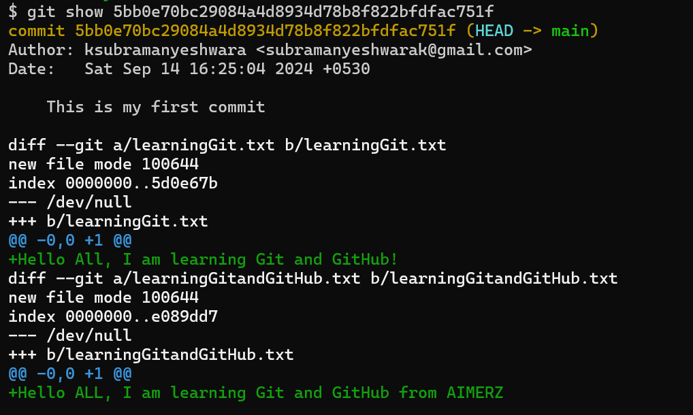

## Flow Diagram

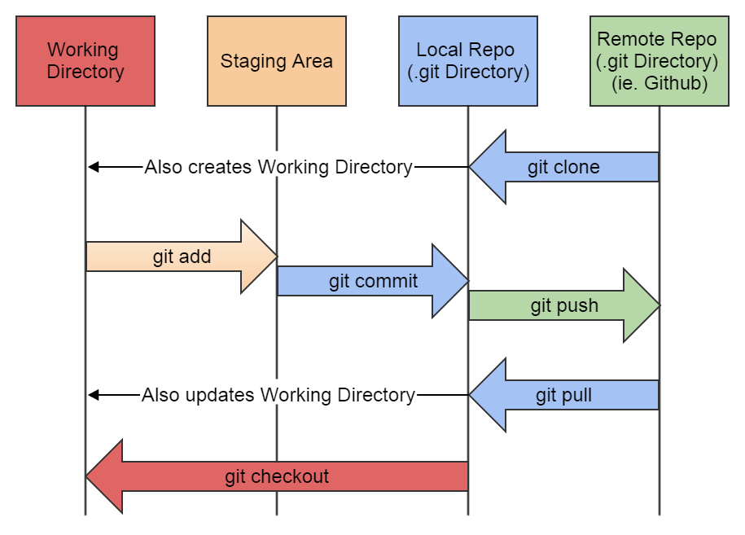

## Branching

Branching allows developers to work on features and resolve bugs and/or experiment in isolation without disturbing the main codebase.

`$git branch`

1.  List branches
    The asterisk (\*) indicates the currently active branch.
    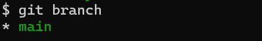

2.  Create a new branch
    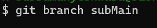

        If we recheck the branches,

    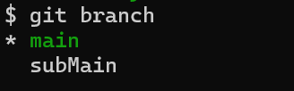

3.  Delete a branch
    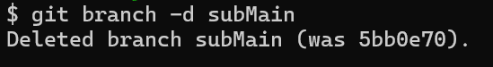

        You can also force delete a branch `git branch -D branch-name`

4.  Renaming the current branch
    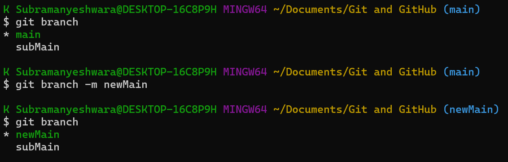

5.  Show more information: To see the last commit on each branch
    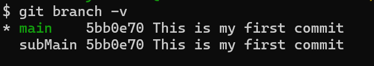

6.  To change the branch
    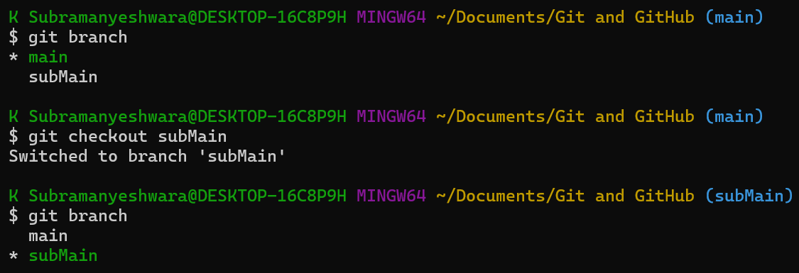
    create and change the branch
    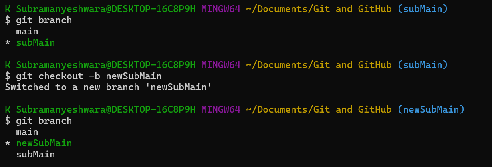

> When you create a new file in a different branch and commit it in the new branch will not affect the main branch
> 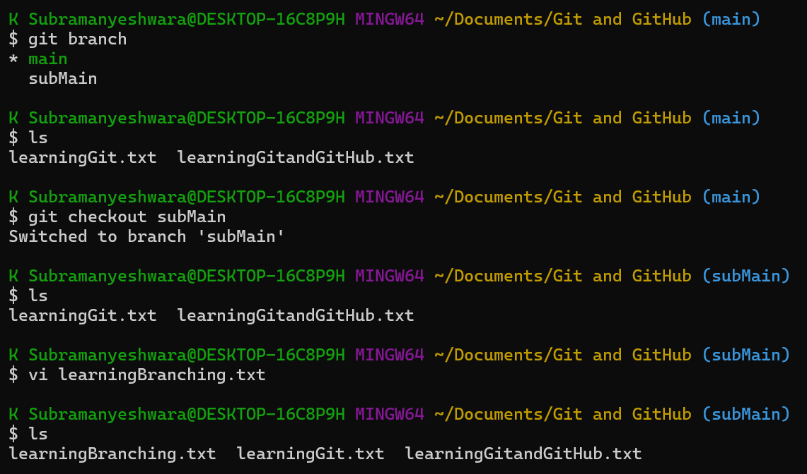
> 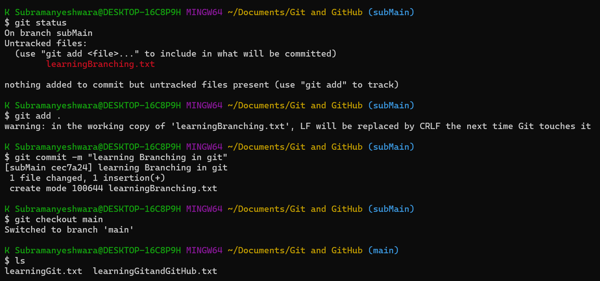

**How do you go to a particular commit ID? and create a new branch?**
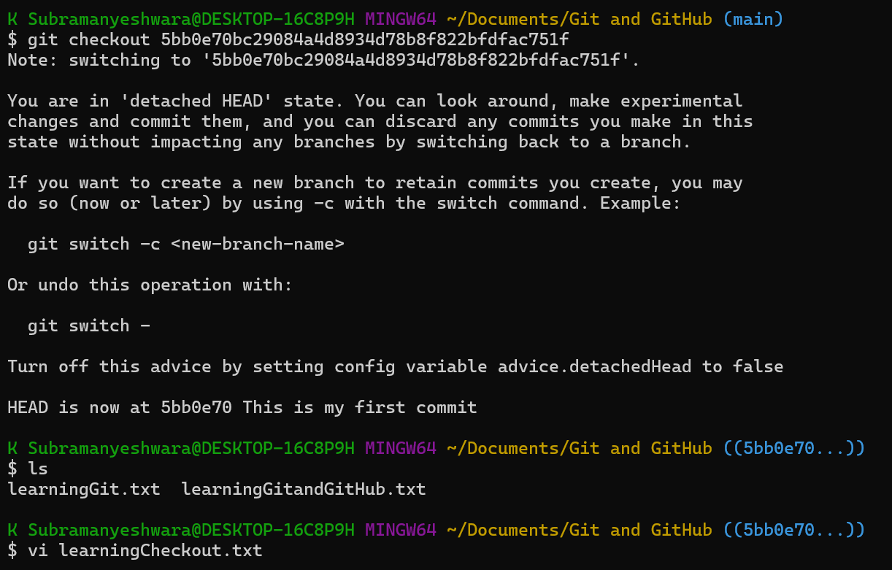
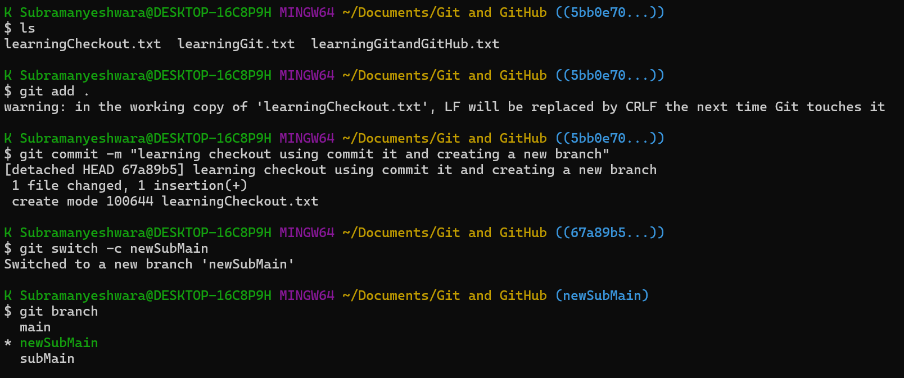

## Merge and Merge Conflict

To merge files from different branches to the main
`$git merge branchName`
Once you give this command, an VI editor will open and write the meaningful merge message

### merge conflict

**Before resolving conflicts:**

- Run `git status` to identify conflicting files.
- Use `git log --merge` to understand the merge history.

**Resolving conflicts:**

- Open the conflicting file in a text editor.
- Identify conflict markers: `<<<<<<<`, `=======`, and `>>>>>>>`.
- Decide which changes to keep:
  - `<<<<<<<` indicates your local changes (current branch).
  - `=======` separates local and incoming changes.
  - `>>>>>>>` indicates incoming changes (merged branch).
- **Merge changes manually**
  - Keep or remove conflict markers.
  - Resolve overlapping changes.

**After resolving conflicts:**

- Run `git add <file>` to stage resolved files.
- Run `git commit` to commit resolved changes.
- Use `git log` to verify conflict resolution.

## Pull Request

A pull request (PR) is a way to propose changes to a repository's codebase by requesting that your changes be merged into the main branch.

#### Why Use Pull Requests?

1. **Improved Code Quality**: Peer review ensures that changes meet coding standards and are thoroughly tested.
2. **Collaboration**: Facilitates discussion and feedback among team members.
3. **Change Management**: Tracks changes, approvals, and merges.
4. **Testing**: Allows testing before merging into the main branch.

#### Pull Request Process

1. **Create a Branch**: Make changes in a new branch.
2. **Commit Changes**: Regularly commit changes with descriptive messages.
3. **Push Branch**: Push branch to remote repository.
4. **Create Pull Request**: Submit PR via GitHub/GitLab/Bitbucket.
5. **Review**: Team reviews and discusses changes.
6. **Approve**: Approved by maintainers or reviewers.
7. **Merge**: Changes merged into the main branch.

#### Key Elements of a Pull Request

1. **Title**: Clearly describes changes.
2. **Description**: Provides context and explains changes.
3. **Labels**: Categorizes PR (e.g., bug fix, feature).
4. **Assignees**: Designates reviewers or owners.
5. **Comments**: Facilitates discussion and feedback.

#### Pull Request States

1. **Open**: Waiting for review.
2. **Approved**: Ready to merge.
3. **Merged**: Changes merged into the main branch.
4. **Closed**: PR rejected or cancelled.

## git clone

Creates a local copy of a remote Git repository. Downloads all repository data, including branches, tags, and history.

**How `git clone` Works:**

- **Connects to remote repository**: Git connects to the remote repository using the provided URL.
- **Downloads data**: Git downloads all repository data, including branches, tags, and history.
- **Creates local directory**: Git creates a new local directory with the same name as the remote repository.
- **Initializes local repository**: Git initializes a new local repository in the created directory.
- **Checks out branch**: Git checks out the specified branch (default: main).
- **How to use `git clone`**

1. Open a terminal or command prompt.
2. Navigate to the directory where you want to create the local copy.
3. Run the command: `git clone <repository-url>`

**Common `git clone` Options:**

- `--branch <branch>`: Clones a specific branch.
- `--depth <n>`: Clones only the last n commits.
- `--single-branch`: Clones only one branch.
- `--mirror`: Creates a mirror repository.

**Example Usage:**

- `git clone https://github.com/user/repo.git`
- `git clone -b dev https://github.com/user/repo.git` (clones dev branch)
- `git clone --depth 1 https://github.com/user/repo.git` (clones only the last commit)

#### Adding a branch to a remote repository

**Step 1: Create a new branch**

- Run `git branch <new-branch-name>` to create a new branch.
- Run `git checkout <new-branch-name>` to switch to the new branch.

**Step 2: Make changes and commit**

- Make changes to your files.
- Run `git add <file-name>` to stage changes.
- Run `git commit -m "<commit-message>"` to commit changes.

**Step 3: Push the branch to a remote repository**

- Run `git push <remote-repo-name> <new-branch-name>` to push the branch to a remote repository.

**Example**

- `git branch feature`
- `git checkout feature`
- `git add .`
- `git commit -m "Add new feature"`
- `git push origin feature` (push to origin remote repo)

**Note**

- Replace `<new-branch-name>` with your desired branch name.
- Replace `<remote-repo-name>` with the name of your remote repository (e.g., origin).
- This will push the branch to the remote repository without merging it into the main branch.

**Pushing to a forked repository**

- If you want to push the branch to a forked repository, use `git push <forked-repo-name> <new-branch-name>`.
- Replace `<forked-repo-name>` with the name of your forked repository.

## git pull

`git pull` fetches changes from a remote repository and merges them into your local repository.

**What does `git pull` do?**

- **Fetches changes**: Downloads changes from the remote repository using `git fetch`
- **Merges changes**: Merges the downloaded changes into your local repository using `git merge`
